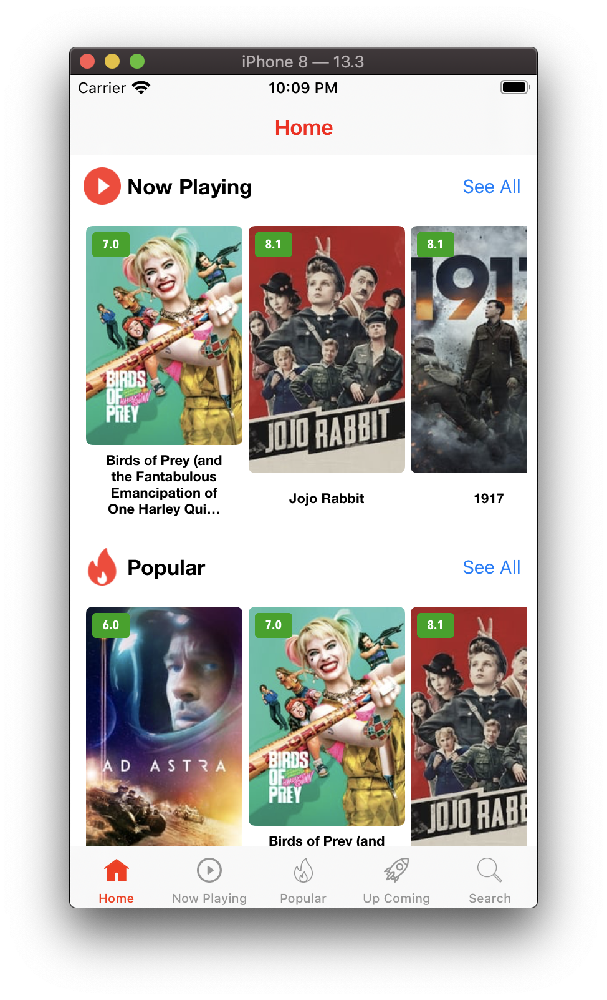
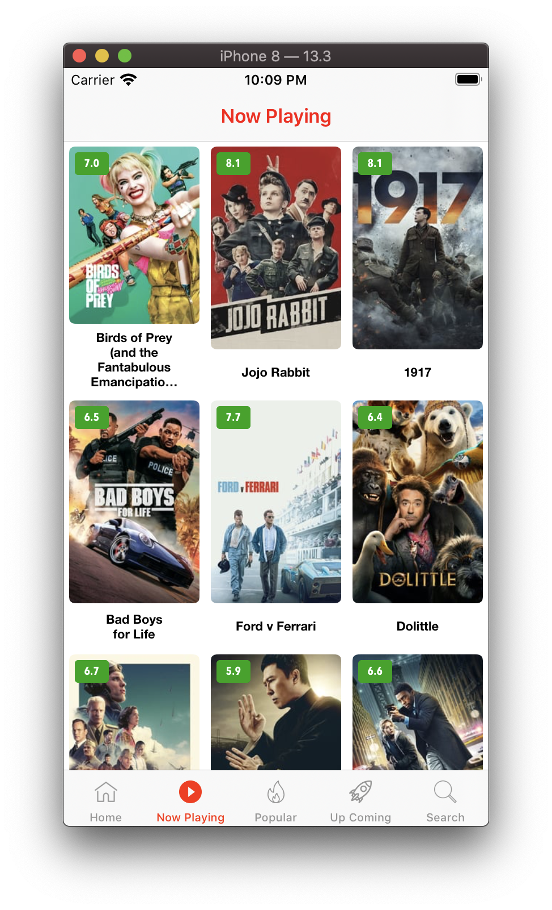
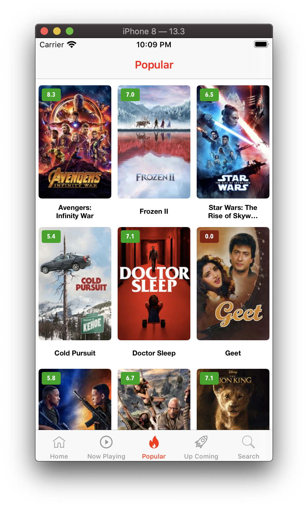
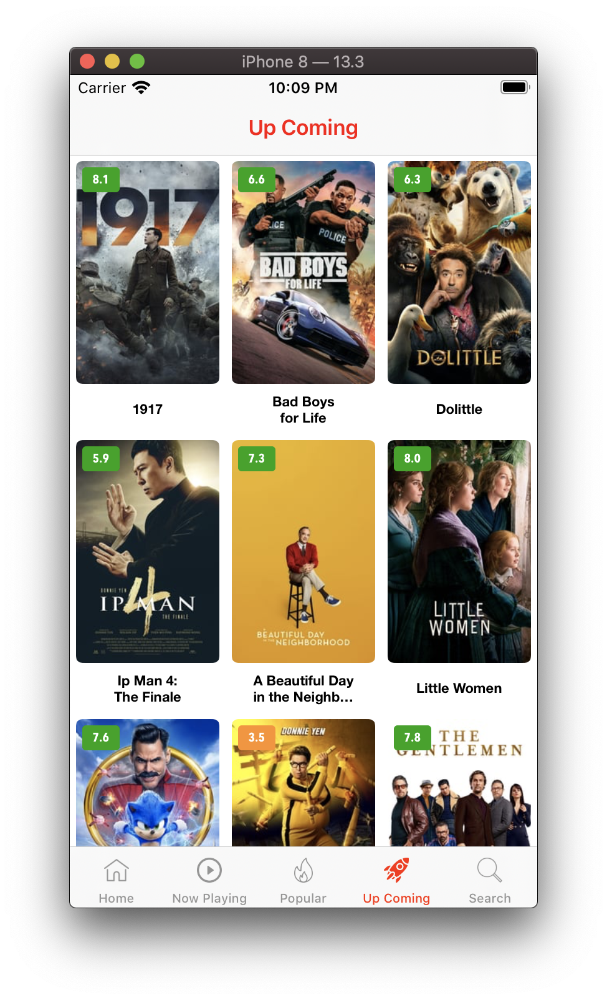
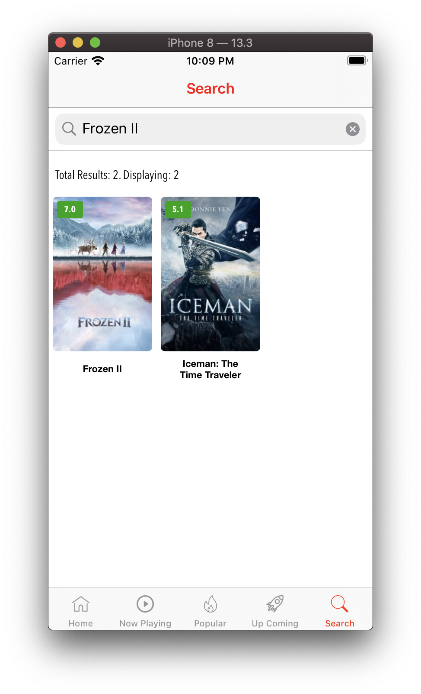
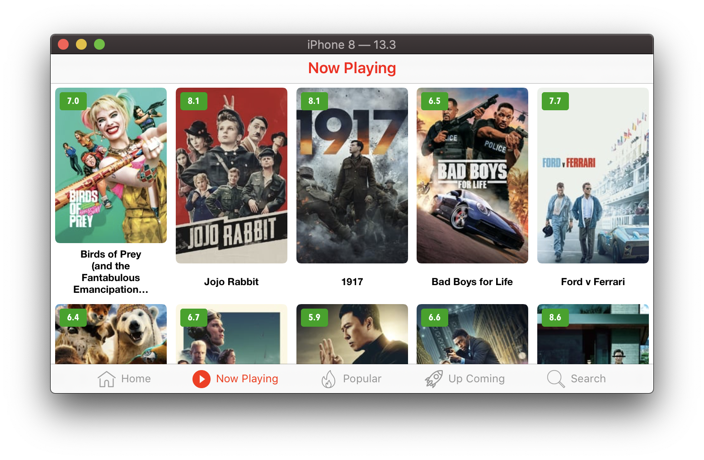
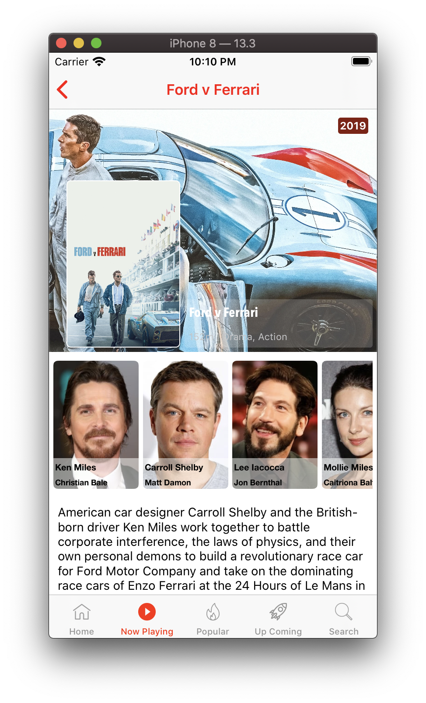
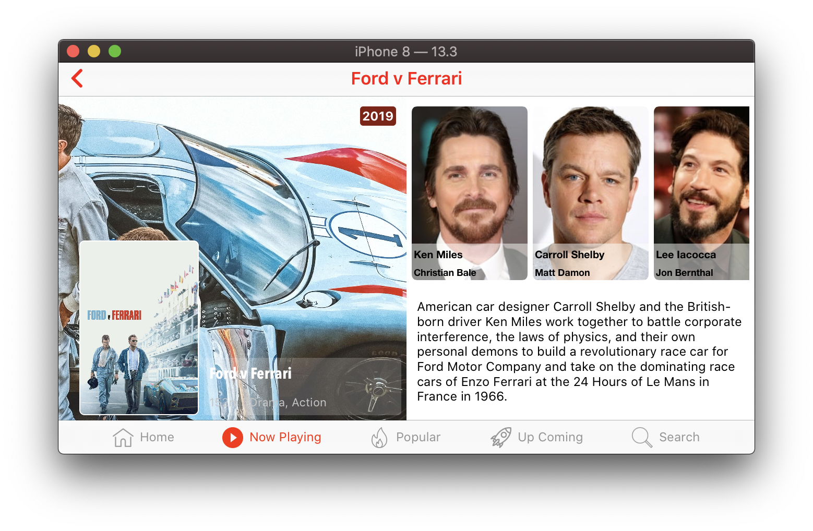

# MovieMaster

MovieMaster is a movie app related which brings you movies that are playing at the moment, popular and up coming movies. The app has the following features:

* Home tab brings you a mix of Now Playing, Popular and Up Coming movies having the ability of `Pull to Refresh`
* Now Playing, Popular and Up Coming tabs have the ability of `Infinity scrolling` and tapping into the tab will take you back to the top
* App is built to run in either `Portrait and Landscape` mode having custom adaptations

# Technical aspects

The following concepts were implemented in the app construction:
* MVVM architecture
* Singleton pattern
* `NotificationCenter`
* Protocols and Delegates
* Reusable code and inheritance
* Swift Generics
* Storyboard, View code and XIB
* Nimble / Quick for Unit tests
* Project is Fastlane ready
* Extensions

# Pods

The following pods were used in the project:

* Alamofire Reachability
* Quick
* Nimble

# Project Structure

Project is structured as the following:
* MovieMaster Schema
  * Source
    * Extensions
    * Commons (Constants, MessagesUtils)
    * Networking
      * Requests
      * Managers
    * Models
    * Views
    * Controllers and ViewModels
    * Storyboards
  * Resources
    * AppDelegate
* MovieMasterTests
  * Modules
    * Movies
    * Movies Details
  * Extras
  * Assets.xcassets

# Screenshots

{:height="250px" width="150px"}
{:height="250px" width="150px"}
{:height="250px" width="150px"}
{:height="250px" width="150px"}
{:height="250px" width="150px"}
{:height="250px" width="150px"}
{:height="250px" width="150px"}
{:height="250px" width="150px"}
{:height="250px" width="150px"}
